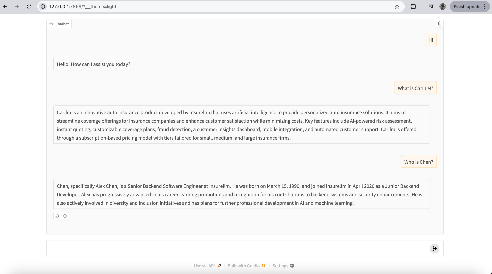

# InsuranceAgent

An intelligent AI assistant for an insurance tech company (Insurellm) that leverages a knowledge base to provide accurate and context-aware responses about company employees, products, and other information.

## Features

- Contextually-aware AI responses using OpenAI's GPT models
- Knowledge base integration with dynamic content retrieval
- Interactive Gradio interface for easy interaction
- Automatic context identification based on user queries
- Vector embeddings for semantic search (in FAISS and Chroma implementations)
- Conversation memory for multi-turn dialogues
- Support for retrieving information about:
  - Employees (HR records, performance history, etc.)
  - Insurance products (Rellm, Markellm, Homellm, Carllm)
  - Company information
  - Contracts and agreements

## Multiple Implementations

This project provides three different implementations of the InsuranceAgent, each showcasing different approaches and technologies:

1. **Basic Keyword Matching (llm_agent.ipynb)**:
   - Simple keyword-based context retrieval
   - Direct OpenAI API integration
   - Lightweight implementation with minimal dependencies

2. **FAISS Vector Database (llm_agent_faiss.ipynb)**:
   - Uses Facebook AI Similarity Search (FAISS) for vector storage
   - LangChain integration for document loading and text splitting
   - Semantic search capabilities with embeddings
   - Conversational retrieval chain with memory

3. **Chroma Vector Database (llm_agent_langchain.ipynb)**:
   - Uses Chroma DB for vector storage and retrieval
   - Full LangChain integration
   - Persistent vector database storage
   - Advanced retrieval capabilities

## How It Works

1. **Knowledge Base Organization**: The system uses a structured knowledge base organized into different categories:
   - `/knowledge-base/products/` - Information about insurance products
   - `/knowledge-base/employees/` - Employee profiles and HR records
   - `/knowledge-base/contracts/` - Contract information
   - `/knowledge-base/company/` - General company information

2. **Context Processing**:
   - Basic version: Scans queries for keywords that match available knowledge contexts
   - Vector versions: Converts documents into vector embeddings and performs semantic search

3. **Response Generation**: The system uses OpenAI's models (specifically GPT-4o-mini) to generate accurate responses based on the retrieved context.

## Requirements

- Python 3.10+
- OpenAI API key
- Required Python packages:
  - openai
  - gradio
  - python-dotenv
  - langchain and langchain-openai (for vector implementations)
  - faiss-cpu (for FAISS implementation)
  - chromadb (for Chroma implementation)
  - scikit-learn and plotly (for visualization in vector implementations)

Example questions you can ask:
- "What can you tell me about Alex Harper?"
- "What is Carllm?"

